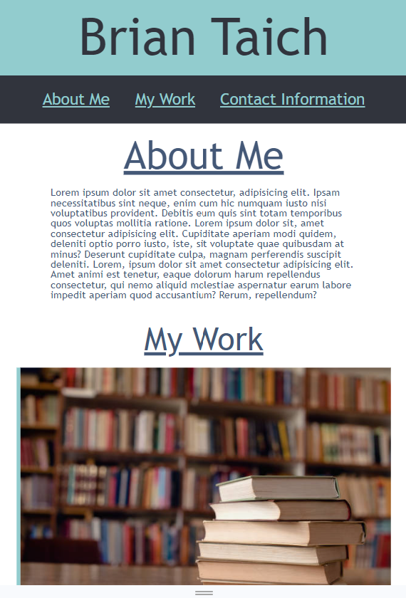

# Brian-Taich-Portfolio

# Prework Study Guide Webpage

## Description
This website contains my portfolio of web apps. It acts an organized hub for employers to view my work and holds any personal information they would need. 
The website itself is also a showcase of my skills.

## Usage

Clicking the links in the navigation bar will bring you to that section of the page. Each image is a link to one of my projects, and links to my contact information are at the bottom.

## License

Refer to the MIT License in the repository

## Website
Link is listed here
https://bewtaich.github.io/Brian-Taich-Portfolio/

